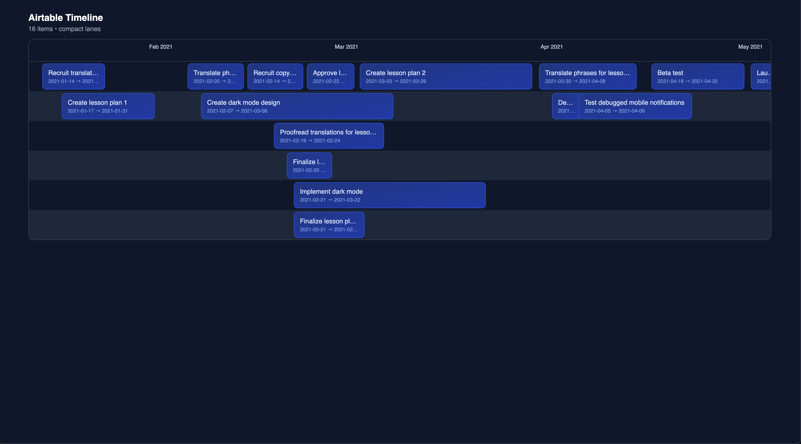

# Timeline Component Implementation



A modern, responsive timeline component built with React and Tailwind CSS that arranges items in compact, space-efficient horizontal lanes.

## Features

- Compact lane organization with smart spacing
- Responsive design that adapts to different screen sizes
- Intelligent width adjustment for items based on content
- Hover effects and visual feedback
- Alternating lane backgrounds for better readability

## What I Like About the Implementation

1. **Smart Space Utilization**

   - The timeline efficiently uses horizontal space by allowing items to share lanes when their dates don't overlap
   - Items automatically expand to accommodate their content while respecting available space
   - Smart width calculations ensure text remains readable even for short duration items

2. **Visual Design**

   - Clean, modern aesthetic inspired by a pricing table designs (specifically [this design](https://img.freepik.com/premium-psd/pricing-table-template-website_206192-23.jpg))
   - Hover effects enhance interactivity

3. **Code Organization**
   - Separation of concerns with hooks (useWindowSize, useMeasureText)
   - Smart memoization of expensive calculations
   - Reusable utility functions for date handling
   - Maintainable color system using Tailwind CSS

## What I Would Change

1. **Performance Optimizations**

   - Implement virtualization for large datasets

2. **Additional Features**

   - Zooming capabilities for different time scales
   - Drag and drop support for changing dates
   - Inline editing for item names
   - Timeline header with year/month navigation

3. **Code Structure and Development tools**
   - I wouldn't use Copilot for large pieces of code if the codebase doesn't use Typescript, it slowed me because I had to debug so many bugs.
   - Use Typescript
   - Break down the Timeline component into smaller, more focused components
   - Create a more comprehensive theme system with light and dark mode
   - Add animation configuration options

## Design Decisions

1. **Layout**

   - Implemented smart width calculations to balance between date-based width and content requirements
   - Added alternating background stripes for better visual separation

2. **Visual Design**
   - Inspired by modern pricing table design because I liked it and didn't find much timelines that I liked
   - Added visual feedback (hover effects, transitions) for better interactivity

## Testing Approach

Given more time, I would implement the following testing strategy:

1. **Unit Tests**

   - Test date utility functions
   - Verify lane assignment logic
   - Test text measurement calculations

2. **Integration Tests**

   - Test interaction between components
   - Verify data flow and updates

## Running the Project

1. Clone the repository
2. Install dependencies:
   ```bash
   npm install
   ```
3. Start the development server:
   ```bash
   npm start
   ```
4. It will open [http://localhost:1234](http://localhost:1234) in your browser

## Technologies Used

- React
- Tailwind CSS
- Canvas API for text measurements
